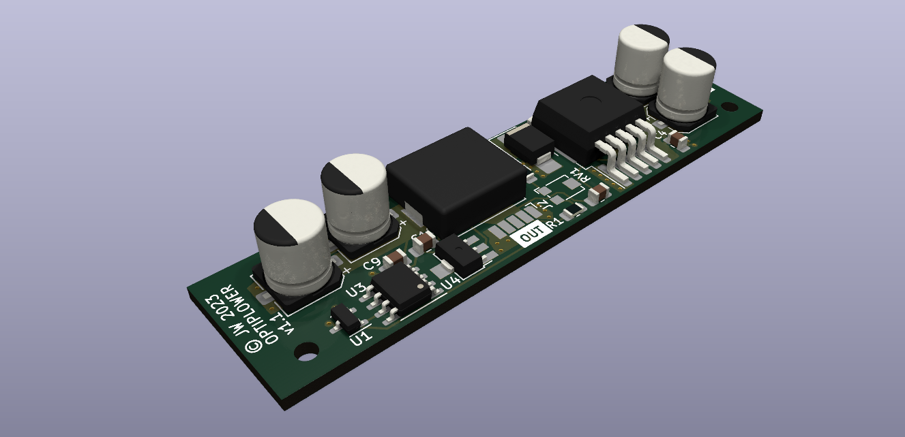
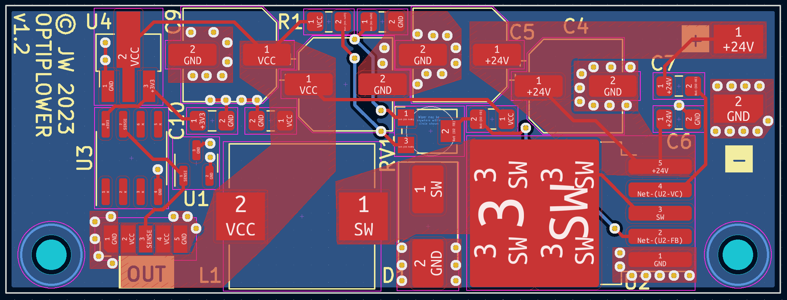

# Optiplower

Dell Optiplex Power supply experiments.

I want to run a Dell Optiplex 3050 Micro off an industrial 24Vdc supply. Two issues:

1. The Dell takes 19.5v
2. It will refuse to clock above 800MHz if it can't communicate with the charger to check how much
   power it can provide.

This project aims to solve both by incorporating:

1. A 5A DCDC converter to give 19.5v from 24v input
2. Either an ATTiny85 or a DS2502 to communicate with the mainboard and spoof it into thinking it
   has a 65W PSU attached.

Onto a single, tiny PCB that can be hidden away inside the Dell.

With thanks to

- <https://github.com/KivApple/dell-charger-emulator>
- <https://github.com/garyStofer/DS2502_DELL_PS>
- Among others

Please use KiCAD 7 to open the board files. The PSU uses JLC/LCSC-sourcable parts if you'd like to
build your own.

