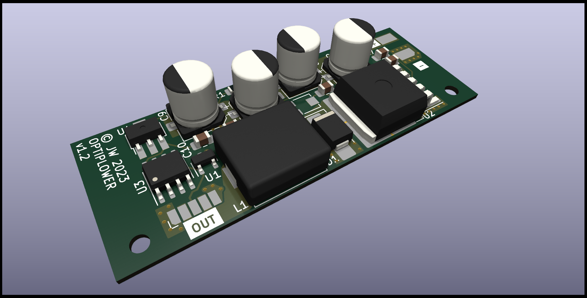

# Optiplower

Dell Optiplex Power supply experiments.

I want to run a Dell Optiplex 3050 Micro off an industrial 24Vdc supply. Two issues:

1. The Dell takes 19.5v
2. It will refuse to clock above 800MHz if it can't communicate with the charger to check how much
   power it can provide.



This project aims to solve both by incorporating:

1. A 5A DCDC converter to give 19.5v from 24v input
2. Either an ATTiny85 or a DS2502 to communicate with the mainboard and spoof it into thinking it
   has a 65W PSU attached.

Onto a single, tiny PCB that can be hidden away inside the Dell.

References:

- <https://github.com/KivApple/dell-charger-emulator>
- <https://github.com/garyStofer/DS2502_DELL_PS>
- <https://github.com/timothyjager/DellPSU>
- <https://www.instructables.com/Embedded-EEPROM-Into-DELL-Laptop-for-Charger-Ident/>
- <https://github.com/HclX/DELL_POWER_SPOOFER>
- <https://blog.project-insanity.org/2020/05/25/hardware-fix-for-dell-ac-power-adapter-could-not-be-determined/>
- Among others

Please use KiCAD 7 to open the board files. The PSU uses JLC/LCSC-sourcable parts if you'd like to
build your own.


DigiSpark ATTiny85 devboard LED is connected to PB0

## Sample dumps

- `DELL00AC090195046CN09T` (90w) from
  <https://github.com/garyStofer/DS2502_DELL_PS/blob/master/DS2502_DELL_PS.ino> or
  `DELL00AC090195046CN09T2157161543835EAL03` with checksum
- `"DELL00AC045195023CN0CDF577243865Q27F2A05=\x94"` (45w)

## Firmware setup

```bash
apt install gcc-avr avr-libc
# For reading/writing IC once programmed
pip3 install pyserial

make

# Write to device
make load

# Write EEPROM (generated with `dell-charger-data-editor.py`)
make load_eeprom

# Write code
make load_rom
```

## Circuit notes

- Using a DigiSpark module for testing
- Enable internal pullups on ATTiny85
- Run ATTiny at 2.7v (lowest allowable for non-`V` chips), otherwise the pin doesn't pull high
  enough
- Ensure AVR fuses are written with `cd firmware && make fuses` otherwise EEPROM gets blatted after
  every flash

---

# A different attempt, this time with Arduino

- <https://github.com/orgua/OneWireHub> for OneWire peripheral impl
- Needs ATTiny arduino cores from <https://github.com/damellis/attiny>

## Burning bootloader issues

Arduino IDE 2.x, "burn bootloader" with usbasp programmer selected.

Need to swap out programmer for the one on the system or various lib versions won't match, e.g.

```
error while loading shared libraries: libtinfo.so.5: cannot open shared object file: No such file or directory
```

E.g.

```bash
mv /home/james/.arduino15/packages/arduino/tools/avrdude/6.0.1-arduino5/bin/avrdude /home/james/.arduino15/packages/arduino/tools/avrdude/6.0.1-arduino5/bin/avrdude_old
ln -s $(which avrdude) /home/james/.arduino15/packages/arduino/tools/avrdude/6.0.1-arduino5/bin/avrdude
```
